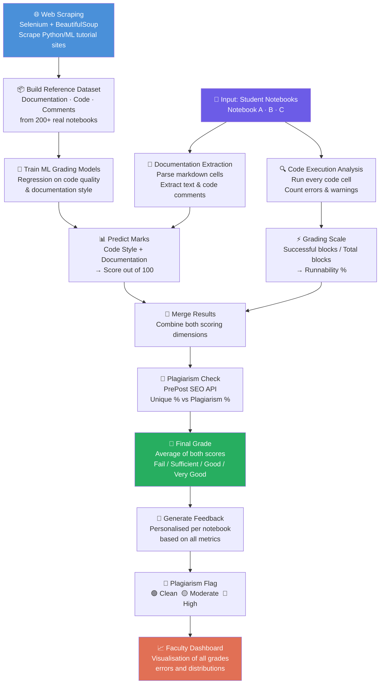
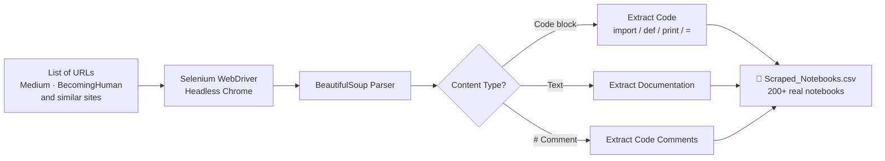
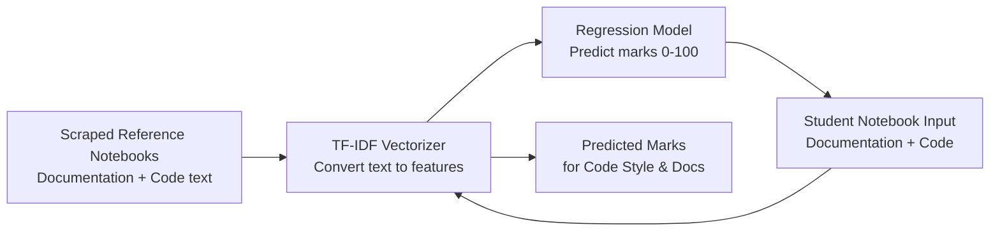
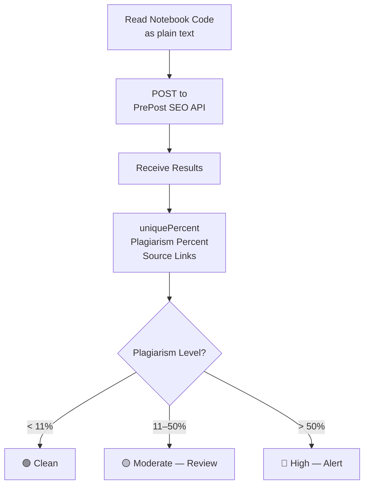

# 📓 Jupyter Grading System

### Automated Grading · Feedback Generation · Plagiarism Detection · Faculty Dashboard

<div align="center">


**An end-to-end automated system that reads student Jupyter notebooks, grades code quality and documentation, detects plagiarism, generates personalised feedback, and visualises everything in a faculty dashboard.**

</div>

-----

## 📖 What Is This? (For Everyone)

> Imagine a professor who has to grade 100 Jupyter notebook assignments — checking whether the code runs, whether the documentation is clear, whether anything was copied, and then writing individual feedback for each student. That takes days.

This system does all of that **automatically**, in minutes.

It:

1. **Scrapes reference data** from Python/ML tutorial websites to understand good coding patterns
1. **Runs student notebooks** and checks whether the code actually executes without errors
1. **Scores documentation quality** using a trained ML regression model
1. **Detects plagiarism** via an external API
1. **Generates personalised written feedback** for every student
1. **Displays a dashboard** for faculty to review all grades and flags at a glance

-----

## 🗂️ Repository Structure

```
Jupyter-Grading-System/
│
├── JUPYTER_GRADING_SYSTEM_(TEXT+CODES+FEEDBACK+PLAGIARISM+_DASHBOARD).ipynb
│       ← The complete pipeline in one notebook
│
├── jupyter_grading_system_(text+codes+feedback+plagiarism+_dashboard).py
│       ← Standalone Python script version
│
└── README.md
```

-----

## 🔄 Complete System Flow



-----

## 🧩 Module-by-Module Breakdown

### Module 1 — Web Scraping (Reference Data Collection)

The system first learns what “good” Python/ML notebooks look like by scraping curated tutorial sites.



**Why scrape?** There’s no labelled dataset of “good” notebook grades. By scraping high-quality notebooks and treating them as reference examples, we can train a model to score student work against that standard.

-----

### Module 2 — Code Execution Grading

Every code cell in a student notebook is executed. The system tracks what runs and what doesn’t.

```python
# For each notebook:
total_code_blocks = 0
successfully_executed = 0

for cell in notebook.cells:
    if cell.type == 'code':
        total_code_blocks += 1
        try:
            exec(cell.source)
            successfully_executed += 1
        except Exception:
            execution_errors += 1

grading_scale = (successfully_executed / total_code_blocks) * 100
```

|Grade Category|Score Range|
|--------------|-----------|
|Very Good     |90–100%    |
|Good          |75–89%     |
|Satisfactory  |60–74%     |
|Sufficient    |50–59%     |
|Fail          |< 50%      |

-----

### Module 3 — Documentation & Code Style Grading

A **TF-IDF + Regression pipeline** is trained on the scraped reference dataset to score documentation quality and code style.



**Penalty rule:** If no code comments are found, **10 marks are automatically deducted** from the code style score.

-----

### Module 4 — Plagiarism Detection

The system uses the **PrePost SEO API** to check every student notebook for plagiarism.



The flag (`🟢 🟡 🔴`) is added as a column in the final results table, making it immediately visible to faculty.

-----

### Module 5 — Final Grade Calculation

The two independent scores are averaged into one final grade:

```
Final Grade = Average(
    Marks For Code Style & Documentation Style,
    Grading Scale For Codes/Algorithm Runnability
)
```

|Final Category|Score Range|
|--------------|-----------|
|Very Good     |90–100     |
|Good          |75–89      |
|Satisfactory  |60–74      |
|Sufficient    |50–59      |
|Fail          |< 49       |

-----

### Module 6 — Personalised Feedback Generation

For every notebook, a structured feedback report is automatically generated based on all measured metrics:

```
Project Title: [Name]

Documentation:
  - "The documentation is brief. Consider adding more details."
  - OR "Good job on documentation length. Ensure it's clear and comprehensive."

Code Quality:
  - "Nice use of Pandas. Explore NumPy for diverse operations."
  - "Address the N errors/warnings found in your code."

Grades:
  - "Improve your code and documentation style for better readability."
  - "Aim to enhance code algorithm runnability and efficiency."

Overall:
  - "Excellent work on the project! Keep up the good work."
  - OR "There's significant room for improvement."
```

This is fully automated — no manual writing needed by the instructor.

-----

### Module 7 — Faculty Dashboard

Three side-by-side visualisations give faculty an instant overview:

```
┌──────────────────────┐  ┌──────────────────────┐  ┌──────────────────────┐
│ Code Style +         │  │ Errors / Warnings     │  │ Distribution of      │
│ Documentation Marks  │  │ Found per Notebook    │  │ Final Grades         │
│ (Stacked bar)        │  │ (Bar chart)           │  │ (Bar chart)          │
└──────────────────────┘  └──────────────────────┘  └──────────────────────┘
```

-----

## 📋 Final Output Table (JGS DataFrame)

The complete output `JGS` contains all of the following per notebook:

|Column                                          |Description                         |
|------------------------------------------------|------------------------------------|
|`Project Title`                                 |Notebook filename                   |
|`Documentation Text`                            |Extracted doc content               |
|`Code Used`                                     |Extracted code                      |
|`Marks For Code Style & Documentation Style`    |ML-predicted score                  |
|`Grade For Code Style & Documentation Style`    |Letter grade                        |
|`Errors/Warnings Found`                         |Count of execution failures         |
|`Grading Scale For Codes/Algorithm Runnability` |% of cells that ran                 |
|`Grade Category For Codes/Algorithm Runnability`|Category                            |
|`Execution Time (s)`                            |How long the notebook took          |
|`Final Grade for the Notebook`                  |Combined final %                    |
|`Final Grade Category`                          |Fail / Sufficient / Good / Very Good|
|`Comprehensive Feedback`                        |Full auto-generated feedback        |
|`Unique Percent Detected`                       |From plagiarism API                 |
|`Plagiarism Percent Detected`                   |From plagiarism API                 |
|`Links Detected`                                |Matched source URLs                 |
|`Plagiarism_Flag`                               |🟢 / 🟡 / 🔴                           |

-----

## 🛠️ Tech Stack

|Tool / Library    |Role                             |
|------------------|---------------------------------|
|`selenium`        |Headless browser for scraping    |
|`BeautifulSoup`   |HTML parsing                     |
|`requests`        |HTTP requests & API calls        |
|`nbformat`        |Read and parse `.ipynb` files    |
|`scikit-learn`    |TF-IDF + Regression grading model|
|`pandas` / `numpy`|Data manipulation                |
|`matplotlib`      |Faculty dashboard charts         |
|`PrePost SEO API` |External plagiarism detection    |

-----

## 🚀 Getting Started

### 1. Clone the Repository

```bash
git clone https://github.com/Aryan-Bajaj/Jupyter-Grading-System-with-Feedback-Plagiarism-Documentation-check-Codes-check-Dashboard.git
cd Jupyter-Grading-System-...
```

### 2. Install Dependencies

```bash
pip install selenium beautifulsoup4 requests nbformat scikit-learn pandas numpy matplotlib

# Install Chromium WebDriver (for scraping)
apt-get install chromium-chromedriver
```

### 3. Configure Your Notebooks

At the top of the notebook, set the paths to the student notebooks you want to grade:

```python
A = "/path/to/Student_Notebook_A.ipynb"
B = "/path/to/Student_Notebook_B.ipynb"
C = "/path/to/Student_Notebook_C.ipynb"
```

### 4. Set Your Plagiarism API Key

```python
api = "your_prepostseo_api_key_here"
```

Get a free key at [prepostseo.com](https://www.prepostseo.com)

### 5. Run All Cells Top to Bottom

The notebook is self-contained. Running all cells will:

- Scrape reference data
- Train the grading model
- Grade all student notebooks
- Check plagiarism
- Generate feedback
- Show the faculty dashboard

-----

## 📝 Customisation

**Add more scraping URLs:** Edit the `urls` list in the Web Scraping section to include more tutorial sources.

**Add more student notebooks:** Add paths to the `notebook_files` and `notebook_paths` lists.

**Change grade thresholds:** Modify the `map_grades()` function to match your institution’s grading scale.

**Ignore a URL in plagiarism check:**

```python
ignore_url = 'https://your-course-materials-site.com'
```

-----

## ⚠️ Disclaimer

This system is a digital teaching assistant and should be used to support, not replace, human judgment. Code execution grading depends on the execution environment. Plagiarism thresholds may need adjustment for your context. Always review flagged cases manually.

-----

## 👤 Author

**Aryan Bajaj** — [GitHub](https://github.com/Aryan-Bajaj)

## 📄 License

MIT License — see <LICENSE> for details.
